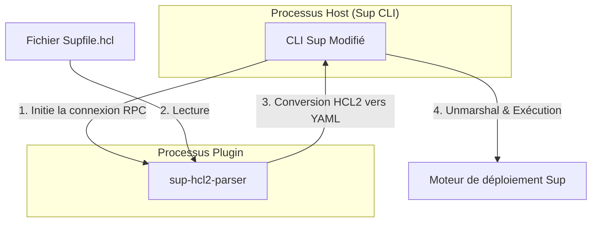

# Plugin HCL2 pour Sup

Ce projet propose un plugin basé sur le framework HashiCorp `go-plugin` permettant à l'outil de déploiement [Sup](https://github.com/pressly/sup) de supporter nativement le format de configuration HCL2.

Le format HCL2 (HashiCorp Configuration Language) offre une syntaxe plus expressive et structurée que le format YAML traditionnel, facilitant la gestion de configurations d'infrastructure complexes.

## Architecture du système

Le plugin fonctionne comme un processus indépendant qui communique avec le client Sup via une interface RPC. Cette approche permet de découpler la logique de parsing du coeur de l'application.



### Fonctionnement détaillé

1. **Détection du format** : Lors de l'utilisation du flag `-f`, le binaire Sup vérifie l'extension du fichier. S'il s'agit d'un fichier `.hcl`, la logique de plugin est activée.
2. **Communication RPC** : Sup lance le binaire `sup-hcl2-parser` et établit une communication sécurisée via `net/rpc`.
3. **Parsing et Validation** : Le plugin utilise les bibliothèques officielles de HashiCorp pour valider la syntaxe et décoder la structure HCL2.
4. **Interopérabilité** : Pour garantir une compatibilité totale sans modifier le moteur interne de Sup, le plugin sérialise la configuration en YAML avant de la renvoyer au processus parent.

## Installation et Compilation

### Prérequis
- Go 1.24 ou supérieur
- Un environnement macOS ou Linux

### Procédure de compilation
```bash
# Récupération du dépôt
git clone https://github.com/maelanjais/sup-hcl2-plugin.git
cd sup-hcl2-plugin

# Compilation du binaire plugin
make build-plugin
```

## Utilisation et Démo

Un guide détaillé pour tester le plugin avec des machines virtuelles (utilisant Tart) est disponible dans le fichier [DEMO.md](./DEMO.md).

## Tests Unitaires

Le projet inclut une suite de tests pour garantir l'intégrité du parsing :
```bash
go test -v ./plugin/...
```
