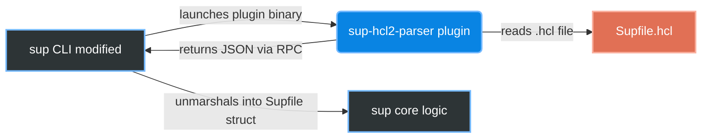

# Sup HCL2 Plugin 🚀

Un plugin HashiCorp (`go-plugin`) qui permet au célèbre outil de déploiement [Sup](https://github.com/pressly/sup) d'utiliser la syntaxe **HCL2** au lieu du YAML !

HCL2 est bien plus lisible, permet de gérer plus facilement les blocs complexes, et est le standard de facto de l'Infrastructure-as-Code.

## 🏗 Architecture Globale

Voici comment le CLI `sup` interagit avec le plugin pour lire les fichiers `.hcl` :



### Comment ça marche sous le capot ?

1. `sup` détecte l'extension `.hcl` via le flag `-f`.
2. Il lance le sous-processus `sup-hcl2-parser` (soit depuis le PATH, soit via le flag `--parser`).
3. Ils communiquent via le protocole RPC de `hashicorp/go-plugin`.
4. Le plugin lit et valide le HCL2, puis renvoie le tout converti en YAML standard.
5. `sup` continue son exécution comme si de rien n'était !

## 🚀 Scénario de Démo

Vous voulez voir ça en action sur de vraies machines virtuelles ? 
Consultez le guide pas-à-pas dans [DEMO.md](./DEMO.md) !

## 🛠 Installation et Compilation

```bash
# 1. Cloner ce dépôt
git clone https://github.com/maelanjais/sup-hcl2-plugin.git
cd sup-hcl2-plugin

# 2. Compiler
make build-plugin

# 3. Tester (Parse un exemple local)
make test
```

## 🧪 Tests Unitaires et CI

Ce projet garantit la non-régression du parsing via des tests unitaires automatisés par **GitHub Actions**.

Pour lancer les tests localement :
```bash
go test -v ./plugin/...
```
