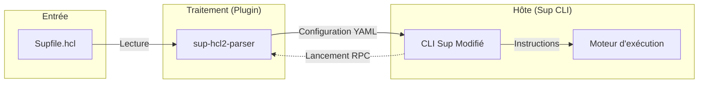

# Plugin HCL2 pour Sup

Ce projet propose un plugin basé sur le framework HashiCorp `go-plugin` permettant à l'outil de déploiement [Sup](https://github.com/pressly/sup) de supporter nativement le format de configuration HCL2.

L'utilisation du format HCL2 (HashiCorp Configuration Language) apporte une structure plus rigoureuse et expressive que le format YAML, facilitant la maintenance de configurations d'infrastructure complexes.

## Architecture du système

Le système repose sur une séparation stricte des responsabilités. Le binaire Sup agit en tant qu'hôte et délègue l'interprétation des fichiers HCL2 à un processus fils spécialisé via une interface RPC.



### Flux de données

1. **Chargement** : L'utilisateur lance Sup avec un fichier `.hcl`.
2. **Intermédiation** : Sup initialise le plugin `sup-hcl2-parser` via le protocole RPC de HashiCorp.
3. **Parsing** : Le plugin analyse le fichier HCL2, valide sa structure et le convertit en une représentation YAML intermédiaire.
4. **Exécution** : Sup reçoit ce flux YAML, le désérialise dans ses structures internes et lance l'orchestration des commandes sur les réseaux définis.

## Installation et Compilation

### Prérequis
- Go 1.24 ou supérieur
- Environnement macOS ou Linux

### Compilation
```bash
# Récupération du code source
git clone https://github.com/maelanjais/sup-hcl2-plugin.git
cd sup-hcl2-plugin

# Génération du binaire du plugin
make build-plugin
```

## Documentation complémentaire

- **Scénario de test** : Un guide complet utilisant des machines virtuelles Tart est disponible dans [DEMO.md](./DEMO.md).
- **Intégration continue** : Les tests unitaires et la compilation sont validés automatiquement via GitHub Actions.

## Maintenance et Tests

Pour garantir la fiabilité du parseur, une suite de tests unitaires est incluse :
```bash
go test -v ./plugin/...
```
